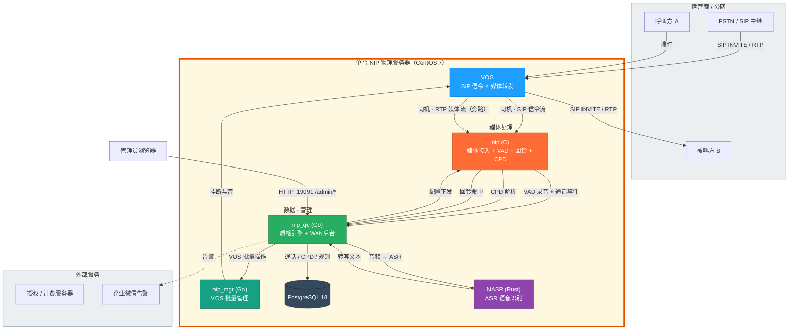

> Vos只代表一种软交换，支持(Vos,FreeSWITCH,Asterisk,Avaya等标准sip软交换)

---

```mermaid
graph TB
    subgraph EXT ["运营商 / 公网"]
        SIP_PSTN["PSTN / SIP 中继"]
        PHONE_A["呼叫方 A"]
        PHONE_B["被叫方 B"]
    end

    subgraph HOST ["单台 NIP 物理服务器（CentOS 7）"]
        direction TB

        VOS["VOS<br/>SIP 信令 × 媒体转发"]

        subgraph MEDIA ["媒体处理"]
            NIP["nip (C)<br/>媒体接入 + VAD + 回铃 + CPD"]
            NASR["NASR (Rust)<br/>ASR 语音识别"]
        end

        subgraph MGMT ["数据 · 管理"]
            NIP_QC["nip_qc (Go)<br/>质检引擎 + Web 后台"]
            NIP_MGR["nip_mgr (Go)<br/>VOS 批量管理"]
            PG[("PostgreSQL 18")]
        end
    end

    subgraph OUT ["外部服务"]
        BILLING["授权 / 计费服务器"]
        WECHAT["企业微信告警"]
    end

    SIP_PSTN -->|"SIP INVITE / RTP"| VOS
    PHONE_A -->|"拨打"| VOS
    VOS -->|"SIP INVITE / RTP"| PHONE_B

    VOS -->|"同机 · SIP 信令流"| NIP
    VOS -->|"同机 · RTP 媒体流（旁路）"| NIP

    NIP -->|"VAD 录音 + 通话事件"| NIP_QC
    NIP -->|"CPD 解析"| NIP_QC
    NIP -->|"回铃命中"| NIP_QC
    NIP_QC -->|"音频 → ASR"| NASR
    NASR -->|"转写文本"| NIP_QC

    NIP_QC -->|"通话 / CPD / 规则"| PG

    ADMIN["管理员浏览器"] -->|"HTTP :19091 /admin/*"| NIP_QC
    NIP_QC -->|"配置下发"| NIP
    NIP_QC -->|"VOS 批量操作"| NIP_MGR
    NIP_MGR -->|"挂断与否"| VOS

    NIP_QC -.->|告警| WECHAT

    style HOST fill:#fff8e1,stroke:#e65100,stroke-width:4px
    style EXT fill:#eceff1,stroke:#90a4ae
    style OUT fill:#eceff1,stroke:#90a4ae
    style MEDIA fill:none,stroke:none
    style MGMT fill:none,stroke:none
    style VOS fill:#1e9fff,stroke:#0077d6,color:#fff
    style NIP fill:#ff6b35,stroke:#d14e1e,color:#fff
    style NASR fill:#8e44ad,stroke:#6c3483,color:#fff
    style NIP_QC fill:#27ae60,stroke:#1e8449,color:#fff
    style NIP_MGR fill:#16a085,stroke:#0e6655,color:#fff
    style PG fill:#34495e,stroke:#1b2631,color:#fff
```
